# 🐱 MeowFit (猫猫要健康！)

**MeowFit** 是……韶子为了自己减肥（我恨激素！）和女朋友的运动专门写的APP，这样就能随时在手机上监控今天的摄入和消耗辽，然后顺便加入了饮水、睡眠等模块，要记就记得更全一点嘛。

里面的AI功能其实聊胜于无，大家完全可以在豆包/kimi/千问/deepseek里面问完之后再回来填写，但本着省事嘛能省就省的原则，还是集成了进去，这样也免去切换应用的麻烦了，不过需要各位自备API Key啦（一般一条消息就几分钱，一天最多几毛钱hhh）如果本着省钱的原则，还是建议手动输入~

嘛，总之！终于做出一款几乎没有bug的app了（前面还做了一个整理相册和拼接长图的，但是还是在小米云备份上出了严重的bug导致相册整理几乎不可用……话说安卓很少有iOS端的slidebox那样的相册整理的APP是不是也是这个原因……）！也是过上了自产自销的生活（不被广告繁多的无良APP圈钱什么的qwq）

对辽，这款APP除了调用API之外没有其他联网需求，如果手动输入的话完全可以关闭网络权限，大家放心使用~

p.s.欢迎大家提出各种issues！

---

## 👤 个人资料

初次踏入这款软件，需要先完善一下个人资料，这样才能更准确地估算基础代谢率。**如果平时生活中每天都需要进行大量的体力劳作不会被记到运动中，建议选择适中或活跃。要是每天的运动都会正常记录，除此之外没有其他重体力劳动，选择久坐就可以啦。**

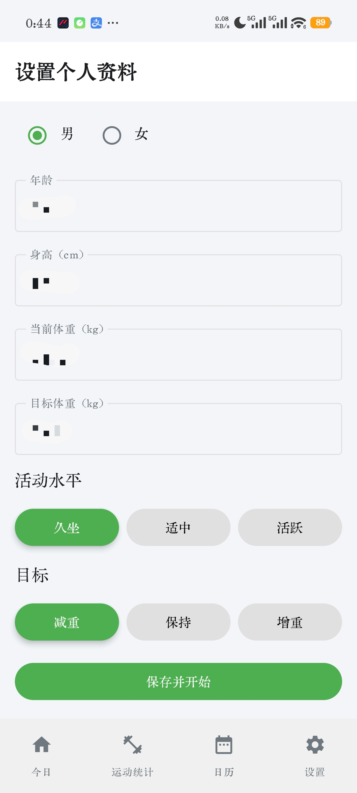

## 🏠 软件主页

推开主页的门，就是咱们的今日面板。
在这里可以把一整天的努力都填进去，包括今日体重、咕噜咕噜喝的水、香甜的睡眠时长，还有吃掉的食物和燃烧的卡路里。

``

轻轻点击顶部的日期，就能穿梭到过去的任意一天去查看或者修改记录（有些软件必须开通会员才能补录数据或者补充打卡，真可恶呀）。

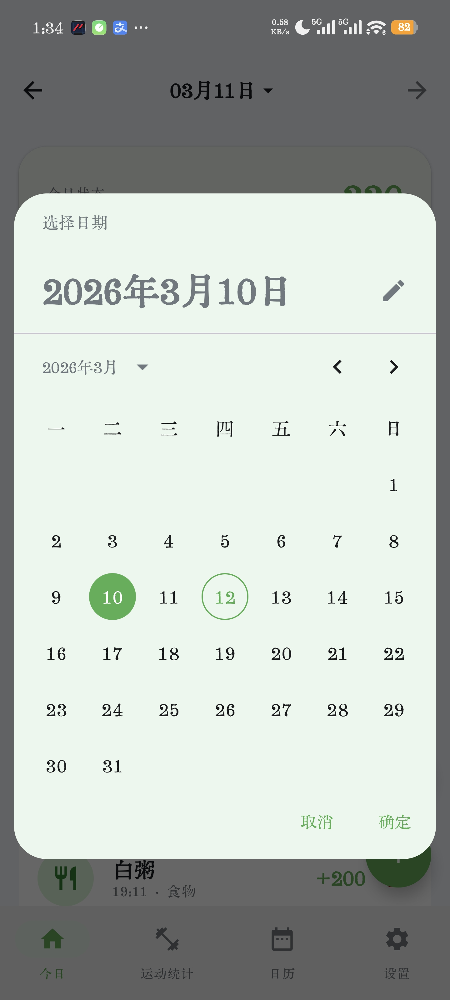

## ⏱️ 运动计时

页面下方藏着一个计时小按钮。准备好挥洒汗水时，点一下就开始记录运动时光啦。

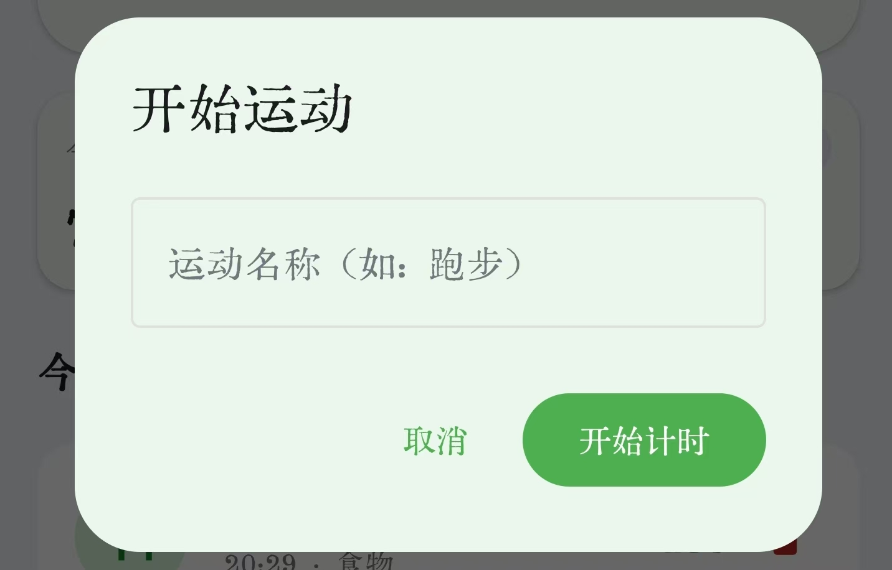
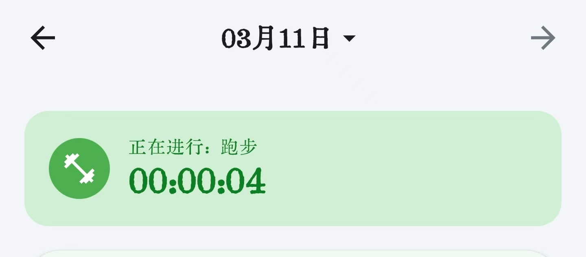
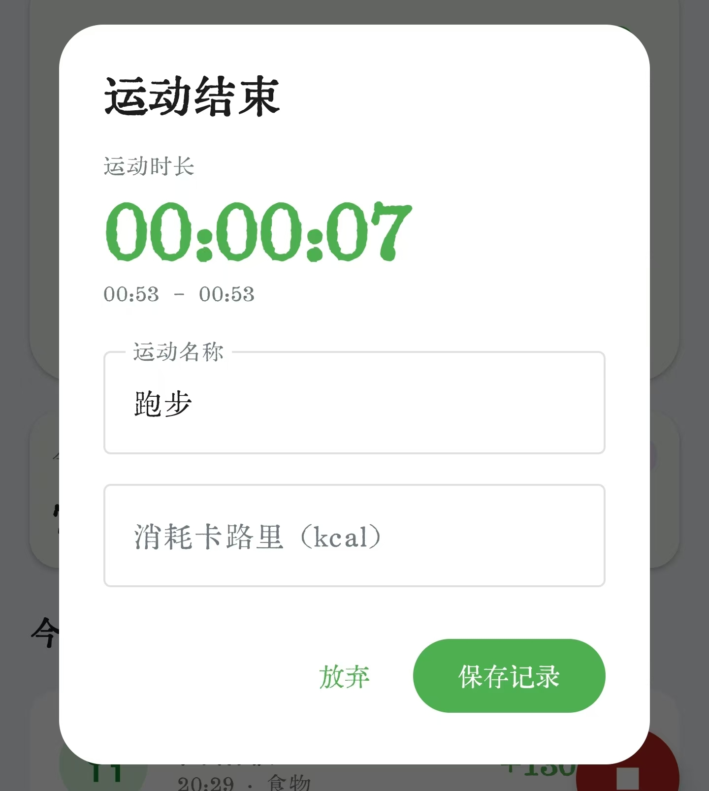

运动告一段落后，输入消耗的卡路里，点击保存记录就能完美收尾。韶子在这里小声提醒，填写的消耗量最好参考自己的智能手表或手环数据，那样会更精准hhh（也可以问问AI自己做了什么运动，持续了多久，AI也会给出一个估算的消耗的卡路里值）。

## ✍️ 添加记录

记录的方式有三种，分别是 AI 对话、拍照识别和手动输入。默认界面是大家都很熟悉的手动录入，就不多做介绍啦。

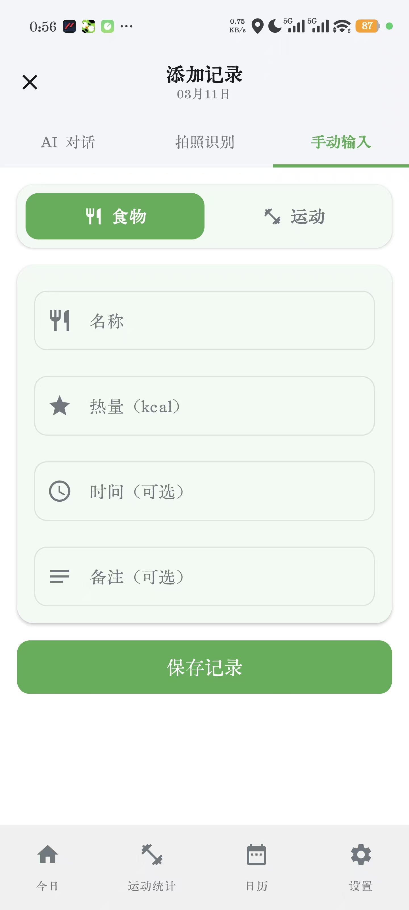

如果在设置里配置好了带有视觉能力的大模型的 API Key，就可以拍下美食或者运动场景让 AI 帮你估算。可以一次选择多张照片哦。由于照片有时难以让模型精确判断食物的具体重量，大家可以在发送前的备注里悄悄告诉 AI 食物的大小或克数，这样它的识别结果就会聪明很多。识别出来的卡片也是可以根据实际情况自由编辑的，确认无误后直接添加就好啦。**（一个小建议，如果是带有包装袋的食品，最好拍下它的净含量以及营养成分表）**

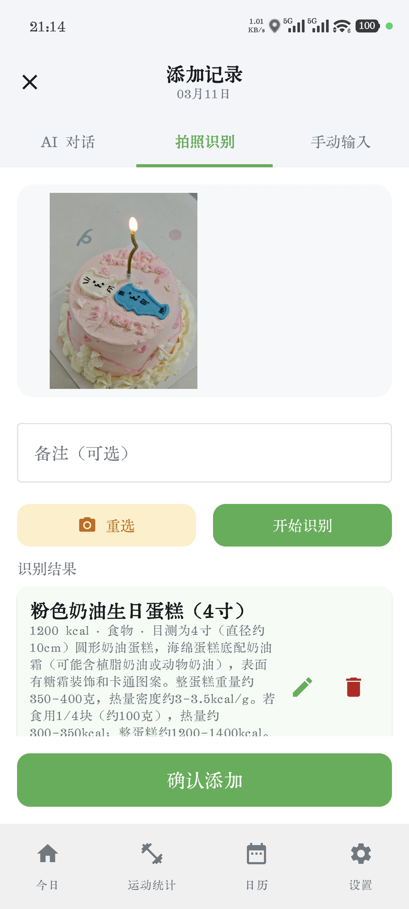

想要更轻松一点的话，可以直接和 AI 聊天。聪明的它会自动从你的话语里捕捉饮食和运动的细节。如果它觉得缺失了重量等关键信息，还会像个小管家一样追问你。平时跟它开开玩笑它也能懂哦。当聊到正常的饮食记录时，就会触发自动生成的小卡片，点一下就能直接添加，非常方便。

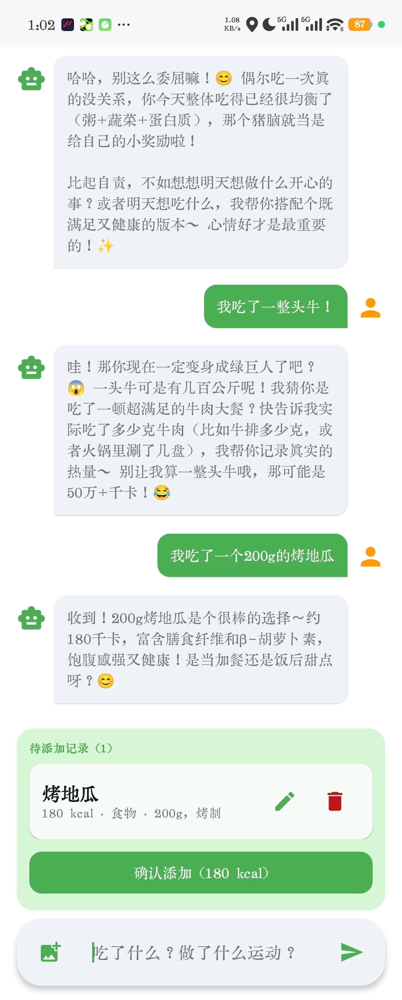

### 📈 运动统计

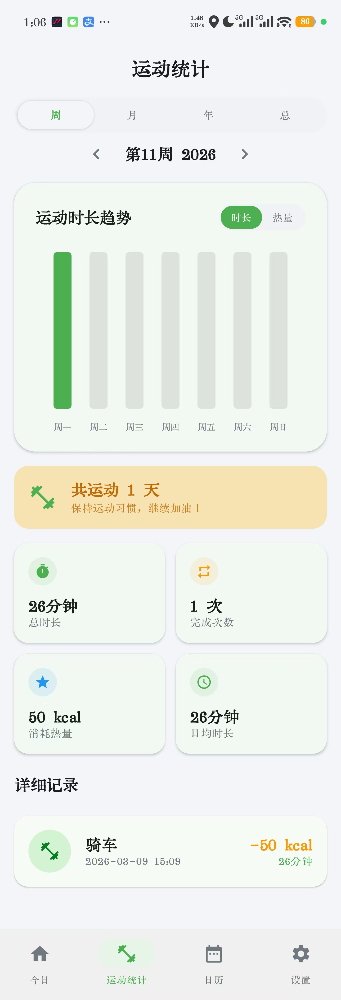

这个页面的灵感来源于**阅读记录**这款读书软件。它把你的努力化作了直观的图表，周视图、月视图、年视图还有总览一应俱全。这一部分就不过多介绍啦（主要是因为韶子不怎么运动（bushi

### 📅 日历与热力图

进入日历界面，映入眼帘的是热量缺口的月度热力图，下方还伴随着体重变化的曲线。只要你每天记录体重，体重趋势模块就会用平滑的曲线地描绘出你的蜕变轨迹。如果没有记录的话，曲线就会自己偷偷藏起来哦。左侧的刻度在截图中被韶子打码隐藏啦，实际是看得到的。

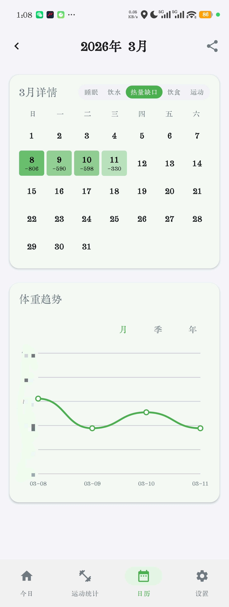

点一点日历上的任何一天，就能回顾当天的详细信息，发现漏记了什么也可以在这里补录。如果需要修改某天已有的记录，只需要回到首页的今日面板，把时间拨回那一天进行修改就好啦。

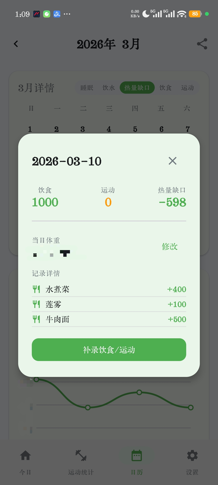

点击左上角向左的小箭头，还能退一步看到更广阔的年视图。

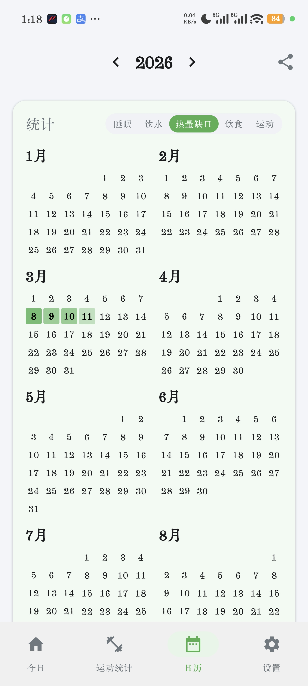

大家可以在设置里给自己定一个小小的睡眠目标。

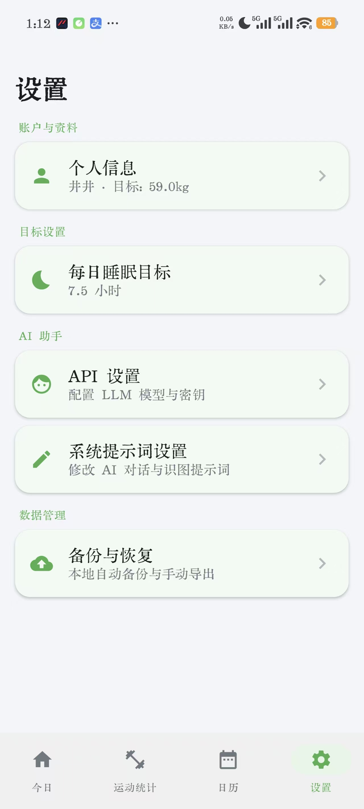

要是哪天达标了，那天的热力图小方格里就会结出一颗亮晶晶的五角星呢。目前睡眠日期下方显示的数字单位是分钟（韶子以后可能会考虑换成小时）。

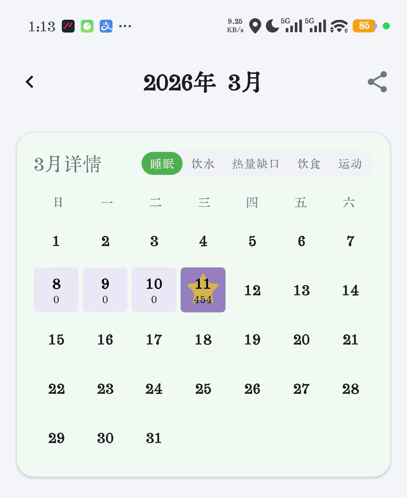

### 🖼️ 日历分享

满载着努力的热力图当然要分享出去呀。点击右上角的分享按钮，就可以把这份记录保存为图片，或者直接发送给微信里的朋友。年视图和月视图都支持热力图保存与分享。

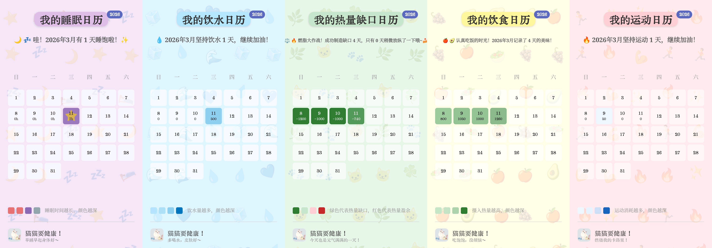
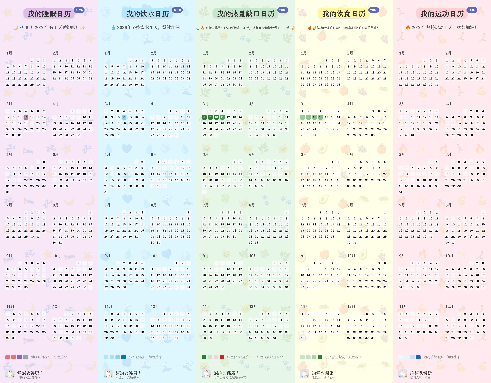

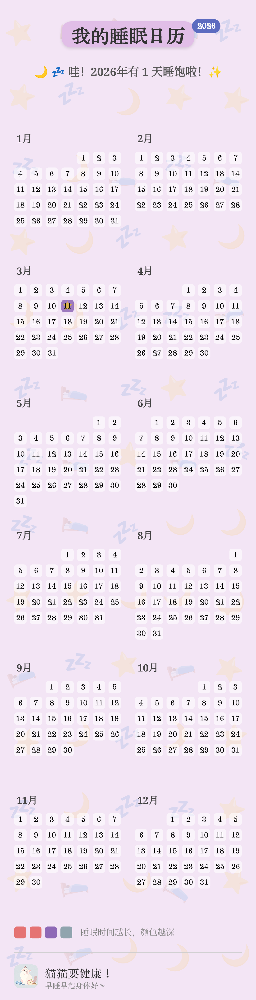

（p.s.这个页面的设计灵感也来自于**阅读记录**APP）

### 📦 数据备份

为了防止更新软件导致数据意外走丢，建议大家经常备份。应用每天初次打开时，都会悄悄把数据备份到手机储存空间的 Download 文件夹里。大家也可以手动选择文件夹进行备份。备份文件是 Json 格式的，如果懂得操作，其实也可以直接用文本编辑软件对备份文件进行修改。

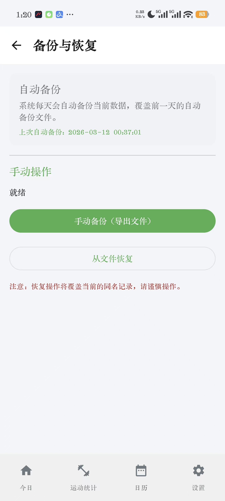

### ⚙️ API 设置

应用支持 OpenAI 格式的各大服务商的 API Key。如果想体验聪明的识图功能，记得挑选带有视觉能力的大语言模型。如果只打算和 AI 纯聊天，那选择任何一个大模型都可以胜任。

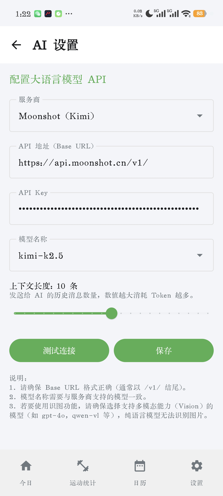

### 📝 提示词设置

您可以根据自己的喜好修改提示词，比如给 AI 设定独特的语气、性格和文风。不过韶子建议最好不要去改动关于数据格式的提示，不然 AI 可能会迷路，就变不出添加记录的小卡片啦。

``

---

## 💻 技术栈

* **语言**: Kotlin
* **UI**: Jetpack Compose (Material Design 3)
* **架构**: MVVM (Model-View-ViewModel)
* **数据库**: Room (SQLite)
* **网络**: Retrofit (用于召唤 AI)
* **异步处理**: Coroutines & Flow
* **导航**: Jetpack Navigation Compose

---

## 🚀 如何运行

想要唤醒专属于你的 MeowFit，只需使用 Android Studio（推荐 Giraffe 或更新版本）打开 MeowFit 目录就可以啦。稍微等待一会儿，让 Gradle 同步完成它的工作。

接着连接上 Android 设备或启动模拟器（p.s.记得系统最低需要支持 Android 8.0 也就是 API 26）。然后您就可以随意修改代码并进行编译了。

最后点击 Run (▶️) 按钮，就能看到属于你自己的专属软件啦！

---

**Made  by [Nephelium](https://github.com/Nephelium)**
